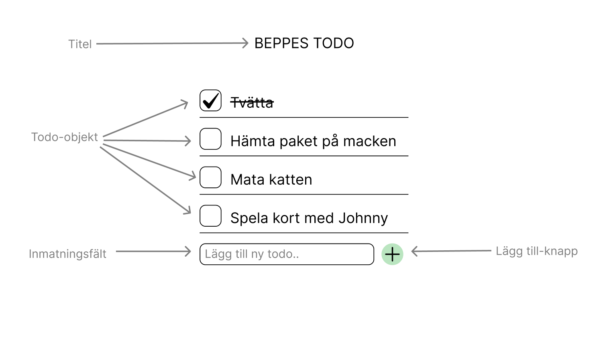

# MU24-frontend-intro-exam

Ni ska göra den klassiska todo-appen. En app som listar saker ni behöver göra, t ex handla mat, hänga upp tvätten, tvätta soffan, förbereda pizzadeg.
Det ska gå att lägga till nya objekt i listan och det ska gå att bocka av saker i listan, så du kan se vad du gjort klart och vad som är kvar.
Fokuset på uppgiften ligger på funktionalitet över utseende.

**G**
* en titel för appen
* en lista för alla objekt
* objekt att stoppa i listan (era todos)
* ett inmatningsfält för nya todo-objekt
* en “lägg till”-knapp för inmatningsfältet

**VG** - det räcker med en av dessa två alternativen 
* Spara listan med hjälp av local Storage
* en sökfunktion för objekten i listan

## lite läsning om Local storage
[MDN](https://developer.mozilla.org/en-US/docs/Web/API/Window/localStorage)

[W3Schools](https://www.w3schools.com/html/html5_webstorage.asp)

[en extra guide](https://blog.logrocket.com/localstorage-javascript-complete-guide/)

